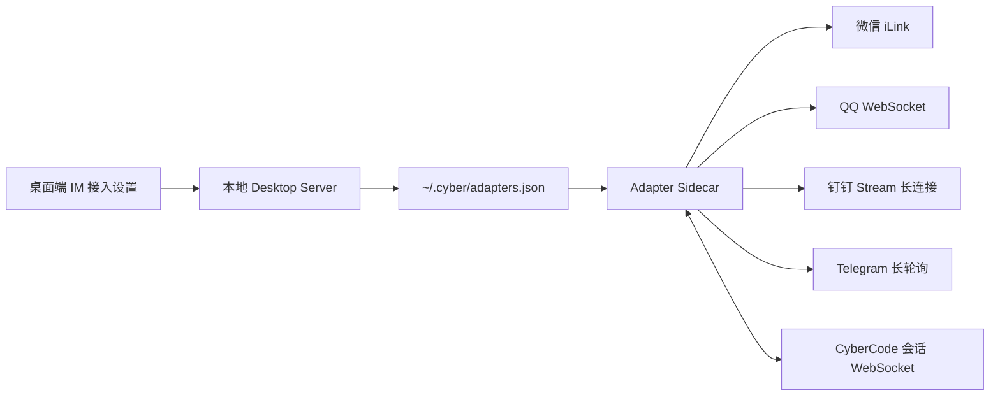

# IM 接入

> 在微信、QQ、钉钉或 Telegram 中远程使用本机 CyberCode。

## 支持的通道

| 通道 | 推荐连接方式 | 是否需要公网回调 |
|------|--------------|------------------|
| 微信 | 腾讯官方 iLink 扫码 | 不需要 |
| QQ | QQ 官方机器人扫码，AppID/Secret 兜底 | 不需要，使用 WebSocket |
| 钉钉 | 企业内部应用 Stream 模式 | 不需要 |
| Telegram | Bot Token 长轮询 | 不需要 |

## 工作方式



桌面版会随应用自动启动 Adapter Sidecar。保存配置、扫码成功、启用或停用通道后，也会自动重启 Sidecar，普通用户不需要安装额外代理或手动运行命令。

## 快速开始

1. 打开桌面端 `设置 -> IM 接入`。
2. 选择微信、QQ、钉钉或 Telegram。
3. 扫码或填写官方凭据，然后保存。
4. 需要授权其他账号时，在同页生成 6 位配对码，再通过 IM 发给 Bot。

微信和 QQ 扫码用户会自动成为首个已配对用户。手动填写 QQ 凭据、钉钉和 Telegram 则使用配对码授权具体用户。

## 会话与命令

| 命令 | 作用 |
|------|------|
| `/help` | 查看帮助 |
| `/new [项目名]` | 新建会话，可模糊匹配项目 |
| `/projects` | 选择最近项目 |
| `/status` | 查看当前项目、模型和执行状态 |
| `/stop` | 停止当前生成 |
| `/clear` | 清空当前会话上下文 |
| `/allow <编号>` | 允许一次工具调用 |
| `/deny <编号>` | 拒绝工具调用 |

同一个 IM 对话会恢复之前的 CyberCode 会话。没有默认项目时，Bot 会让你从最近项目中选择。

## 配置与安全

配置保存在 `~/.cyber/adapters.json`，IM 会话映射保存在 `~/.cyber/adapter-sessions.json`。

- API 返回配置时会对 Token 和 Secret 脱敏。
- `allowedUsers` 和 `pairedUsers` 取并集；两者都为空时默认拒绝访问。
- 配对码 60 分钟有效、一次性使用，并对连续失败尝试限流。
- 微信、QQ 和 Telegram 附件只在本地临时目录中中转；钉钉通道当前只接收文字消息。

## 命令行手动启动

只有在不使用桌面版时，才需要手动启动：

```bash
cd adapters
bun install
bun run weixin
# 或 bun run qq / dingtalk / telegram
```

## 分平台教程

- [微信接入](./weixin.md)
- [QQ 机器人接入](./qq.md)
- [钉钉机器人接入](./dingtalk.md)
- [Telegram 接入](./telegram.md)
