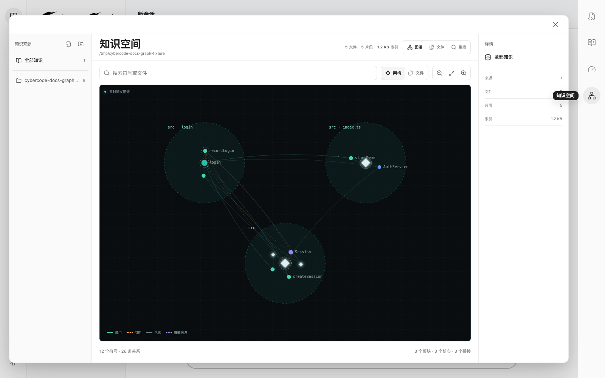
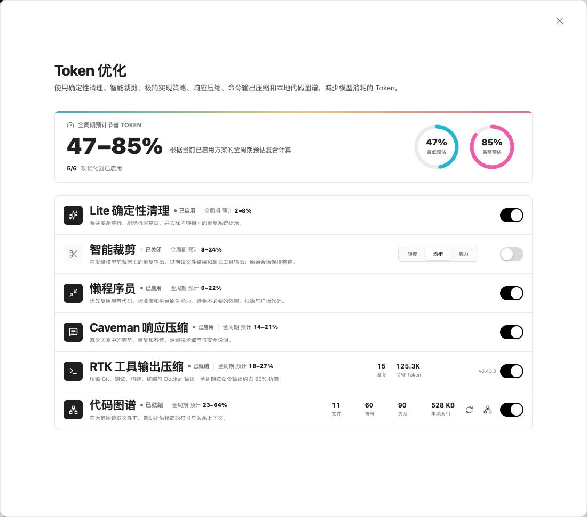

# 小红书发布稿：我被 Claude Code 的 Token 上了一课

## 推荐标题

我被 Claude Code 的 Token 上了一课

备选标题：Claude Code 很能干，也真的很能吃

## 配图顺序

1. 封面：`cover.png`
2. CyberCode 代码图谱：`code-graph.png`
3. CyberCode Token 优化面板：`token-optimization.png`

## 正文

最近这段时间，我几乎每天都在用 Claude Code 写项目。

它确实能干。有时候我只说一句需求，它自己找文件、改代码、跑测试，一套动作比我还熟练。

但用久以后，我也慢慢发现一个挺现实的问题：它不光能干，也真的很能吃 Token。

有一次我只是想改一个设置按钮。它先在项目里搜了一圈，又读了好几个文件，接着跑测试，终端吐出一大段日志。后来我换了个说法继续让它改，前面的搜索结果、文件内容和测试输出又跟着新一轮一起进了上下文。

那一刻我的感觉特别像请了一个按字收费的装修师傅。我只是想换个门把手，他每次进门都要先把整套户型图重新念一遍。

我最早想到的办法也很朴素：在提示词里加一句“请简洁回答”。

有点用，但不多。

因为模型少说两句客套话，只省了回答那一头。真正的大头，很多时候发生在它回答之前：我到底给它送进去了多少重复内容、过期结果和用不上的日志。

后来我开始一项项试。

第一件事，是先把上下文打扫干净。

我把多余空行、尾随空格和完全重复的系统提示先清掉。单看每一处都没几个字，但它们每轮都跟着走，就像搬家时连空纸箱也一直付运费。这个办法不高级，但很稳定，我后来把它叫做 Lite 清理。

第二件事，是不再把老聊天整箱搬给模型。

对话一长，几十轮以前的工具输出、已经失效的文件读取结果、反复出现的报错，其实没有必要原封不动陪跑。我开始只保留任务目标、关键决定和最近仍然有效的上下文，其余内容按相关性压缩或裁掉。

这里我特别在意一件事：本地聊天记录必须完整保留。裁掉的只是“这一轮发给模型的副本”，不是把我的历史记录删掉。

第三件事，是处理最容易被忽略的终端输出。

一次构建、测试或者 Git 命令，随手就能吐出几百上千行。可模型真正需要的，通常只有几件事：成功没有、哪几个测试失败、关键报错是什么、相关文件在哪里。

所以我开始在发送前先压缩工具输出。三千行日志先提炼成一小段结构化结果，再让模型继续判断。这也是我后来集成 RTK 输出压缩的原因。

第四件事，是给 AI 一张代码地图。

项目小时候，搜索文件没什么问题。项目一大，真正费 Token 的往往不是改代码，而是找代码。

没有地图时，AI 像第一次去大型商场：先搜文件名，再开文件，再顺着 import 一层层问路。后来我给项目加了本地代码图谱，让它先看到模块、函数、符号和调用关系，再决定真正需要读哪几段源码。

图谱不能代替源码，但它能少走很多冤枉路。对我来说，这就像先看商场导览，再直接去目标店铺，而不是从一楼开始挨家逛。

最后一件事，是管住回答和代码本身的体积。

我让 AI 少复述需求、少写没必要的前言，技术细节和风险照样保留。写代码时则优先复用已有实现、标准库和平台原生能力，不为了一个小需求突然搭出五层抽象。

说白了就是：话说重点，代码也写重点。

这些方法单独配置都不算难，真正麻烦的是要找工具、改提示词、接流程，还得记住什么任务该开、什么任务不该开。我自己来回折腾几次以后，干脆把它们都做进了 CyberCode。

现在你可以把 CyberCode 理解成：一个集成了这些省 Token 方法、采用 Claude Code 式工作流的开源桌面端。

Lite 清理、智能裁剪、RTK 工具输出压缩、响应压缩、少造轮子的实现策略和本地代码图谱，都做成了可以直接控制的全局开关。需要哪个就开哪个，不合适就关掉，不用自己拼一长串脚本。

不过这一路我也踩过一个很容易忽略的坑：优化不是开得越多越省。

短任务本来就没多少上下文，图谱检索和摘要本身也有固定成本。如果只是问一句小问题，把所有优化全开，消耗反而可能暂时增加。

所以我现在的日常组合，是先开 Lite、RTK 和代码图谱；对话真正变长以后，再打开均衡档的智能裁剪。其他模式则看任务需要，不追求开关全亮。

我现在对“省 Token”的理解也变了。

它不是让 AI 少干活，而是少让它反复读废话、翻旧账，再抱着三千行日志徒步旅行。

如果你也在用 Claude Code，或者正在找一款能自己选择模型、又有图形界面的开源编程 Agent，可以看看 CyberCode。

官网：
https://wk42worldworld.github.io/cybercode/

GitHub 项目首页：
https://github.com/wk42worldworld/cybercode

#ClaudeCode #CyberCode #AI编程 #程序员工具 #Token优化 #开源软件 #效率工具 #代码图谱

## 发布备注

- 正文全程使用第一人称，适合以项目作者身份发布。
- 第二张应用截图中的百分比是产品估算区间，不是所有任务的固定节省比例。
- 小红书正文不支持 Markdown 图片时，按上面的配图顺序上传三张图片即可。
